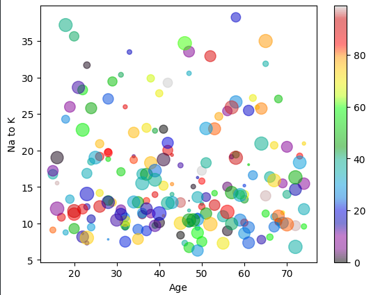

<h1> Drug Classification (Kaggle) - ML Python Project</h1>
 
<h2>Features</h2>
<ul>
    <li>Some techniques to predict the outcome of the drugs that might be accurate for the patient</li>
    <li>Data Visualization with Scatter for Age and Na to K</li>
    <li>Encode the categorical features</li>
    <li>Decision Tree Classifier training the model: 98% accuracy</li>
    <li>Classification Report, Confusion Matrix</li>
</ul>

<h2>Acknowledgments</h2>

<b> Python3: http://bit.ly/python3-certifications </b>
 
<b> Machine Learning: https://bit.ly/machine-learning-certification <b>
 

<h2> Link </h2>
<b> Kaggle: https://www.kaggle.com/datasets/prathamtripathi/drug-classification </b>
 

<h2>Photo</h2>

 
<h2>Contact</h2>

<b> Email: mariusc0023@gmail.com </b>
